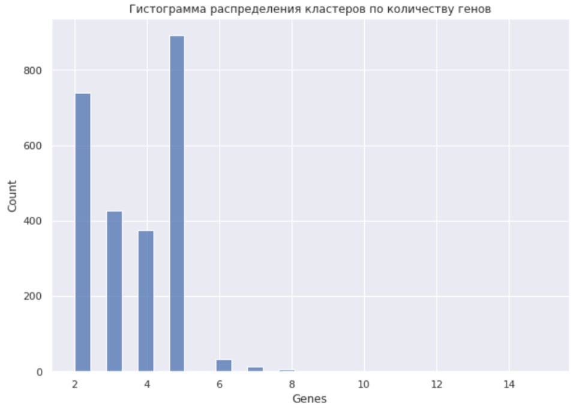

# hse22_project
Detecting Z-DNA & G-quadruplex

### Выбранный таксон -- Firmicutes
### Выбранный род -- Vagococcus

Ссылка на [Colab](https://colab.research.google.com/drive/1uy27_uG5_zELIfSZdXFkw3w5zCEl08vz?usp=sharing)

## Сводная таблица

|    | Название         |   Количество аннотированных генов |   Процент аннотированных генов в геноме |   Количество предсказанных участков Z-DNA |   Количество предсказанных участков Z-DNA с zh_score > 500 |   Общая длина участков с zh_score > 500 |
|---:|:----------------:|:---------------------------------:|:---------------------------------------:|:-----------------------------------------:|:----------------------------------------------------------:|:---------------------------------------:|
|  0 | carniphilus      |                              3300  |                                 92.4398 |                                   3020833 |                                                       2951 |                                   336   |
|  1 | coleopterorum    |                              7246  |                                 88.9068 |                                   1530734 |                                                       1452 |                                   741   |
|  2 | hydrophili       |                              6302  |                                 88.4301 |                                   3045783 |                                                       2871 |                                   656   |
|  3 | teuberi          |                              6228  |                                 88.7810 |                                   2169060 |                                                       2103 |                                   622   |
|  4 | zengguangii      |                              21836 |                                 88.2752 |                                   2190262 |                                                       2002 |                                   2224  |

## Гистограммы ZH-Score

## Полученные гомологичные кластеры
Гистограмма распределения кластеров по количеству геномов | Гистограмма распределения кластеров по количеству генов
-|-
 |  

### Полученные кластеры и количество элементов в них
|  Количество генов  | # Zdna |
|:---|:---------|
|  0 |     2313 |
|  1 |      153 |
|  2 |       16 |
|  3 |        4 |
|  4 |        1 |

| Количество генов в кластере | Гены | Функции генов | Z-Hunt score |
|:---------------------------:|:----:|:-------------:|:------------:|
| 4 | WP_086340814.1 | 30S ribosomal protein S9  | 835.4928 |
| 4 | WP_086950496.1 | 30S ribosomal protein S9 | 835.4928 |
| 4 | WP_071457734.1 | 30S ribosomal protein S9 | 835.4928 |
| 4 | WP_136952382.1 | 30S ribosomal protein S9 | 49376.54 |
| 3 | WP_166034526.1 | dUTP diphosphatase | 766.6232 |
| 3 | WP_166033383.1 | excinuclease ABC subunit UvrA | 6565.992 |
| 2 | WP_245729995.1 | GntR family transcriptional regulator | 583.4285 |
| 2 | WP_071457529.1 | Holliday junction branch migration protein RuvA | 1001.01 |
| 1 | WP_136952870.1 | pyruvate carboxylase | 779.1958 |
| 1 | WP_136953112.1 | 50S ribosomal protein L19 | 2143.653 |

## Визуализация

# G-квадруплексы

Предсказание G-квадрплексов нельзя назвать успешным. 
Был найден геном hydrophili, в котором нашелся 1 квадруплекс. Кроме того, было найдено 2 генома -- teuberi; zengguangi, в которых были найдены 2 квдаруплекса. Ниже прикладываю гистограмы с отображенными на них результатами:

Гистограмма распределения G-квадруплексов у hydrophili | Гистограмма распределения G-квадруплексов у teuberi | Гистограмма распределения G-квадруплексов у zengguangi
-|-|-
 |  | 

Так как Intersect не сработал вследствие того, что он не попадает на координаты внутри slop-файла, прилагаю лишь написанный код, позволяющий отображать картинку расположения G-квадруплекса на геномах:

Я решил несколько ознакомиться с данным родом бактерий. Как мне удалось узнать, Vagococcus — род грамположительных бактерий, впревые выдленный в 1974 году из речной воды, но крайне мало изученный. Возможно, у данной бактерии повышенная склонность к мутации, поэтому и небольшое количество сильно консервативных участков.
